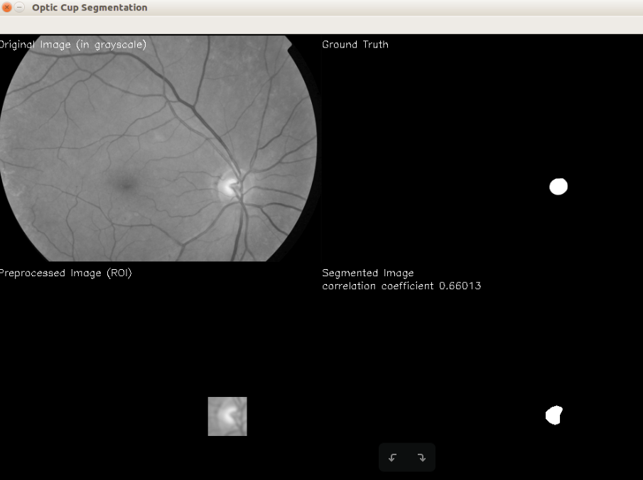

# Optic Cup Segmentation using Adaptive Thresholding and Morphological Image Processing
> This is the first version of DEIE TKEE163221 Image Processing project by Thea Kirana and Vicko Pranowo. The final code will not be published on Github.

## How to use this code:
* Copy the dataset into the folder
* Running on command
```
leathea@leathea:~/FolderName$ python3 segt.py originalImageName.tif
```

## Result


